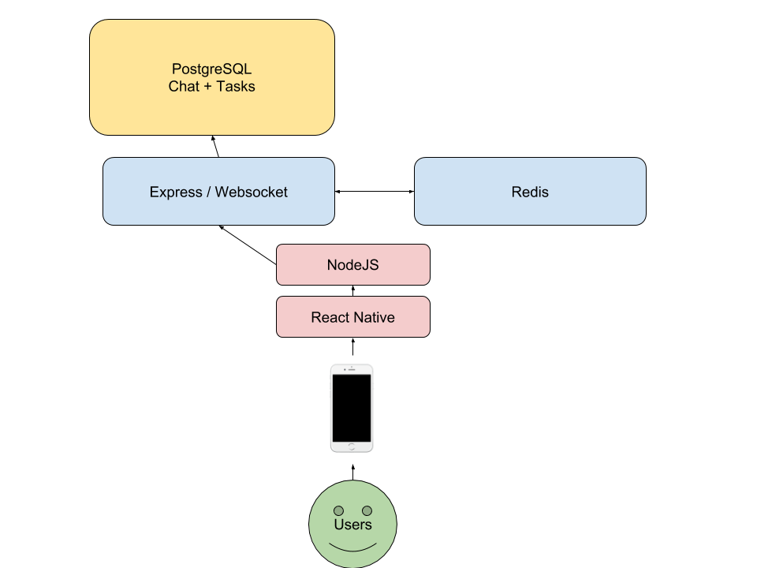

##  Software Design Description

6.1  __Introduction__  --  BetterWe is an app that aims to create an environment for groups to support each other in reaching common goals. People can create groups for dieting, exercise, or any other activity. You will be able to keep track of your friends' progress and be able to hold them accountable with build in features. This will be a React Native application build for Android and iOS compatibility.

6.1.1  __System Objectives__  --  The BetterWe app will be an all inclusive experience for users who are striving towards goal with groups of others. The user will be able to create group activities, or tasks, that they can add group members to. The main communication of the app will be through group messaging. The group messaging page is where users can check on the progress of their group members and use the app specific features to keep their friends accountable for striving towards their collective goal.

6.1.2  __Hardware, Software, and Human Interfaces__  

6.1.2.1  __Hardware__  -- The hardware that the React Native application will run on is Android and iOS platforms. It will be optimized for phones. There will be slight changes in the GUI components that Android and iOS offer, but nothing substantial.

6.1.2.2  __Software__  

6.1.2.2.1  __Front-end__  --  The front-end of the application will be created with React Native. React Native is a derivative of Javascript created by Facebook, so it has a lot of functionality and documentation online. Our react native code will be organized and modularized to make it easier to work with.

6.1.2.2.2  __Back-end__  --  The back-end of BetterWe will be our two PostgreSQL databases. One database will hold all of the information on the tasks that the groups have created. Another database will be used to store the chat information within each group. Both of the databases will hold user information relating to who are in the task groups, who the messages are from, progress on the tasks, and other necessary information.

6.1.2.3  __Human Interface__  --  The human interface is an app with basic menu structures. Below are mockups for the user interface.

6.1.2.3.1  __The Login Page__  --  This page is displayed as the application is opened. The username and Password text boxes are displayed at the front, and a user only needs to input this information to enter the app. The ‘Don’t Have an Account?’ link leads the user to our separate Create Account page.

6.1.2.3.2  __Create Account page__  --  This page has simple text boxes that a new user must fill out with their username, email, password, and a password confirmation. The ‘Create Account’ button at the bottom of the page will create a new user with this email.

6.1.2.3.3  __Homepage__  --  After a user logs in on the Login Page, they will be directed to the Homepage. Here, a user can see all the groups that he/she is part of in the center of the page. Pressing on any of these boxes will redirect the user to the Chat Launch page for that specific group. At the top left corner, there is a Sign Out button. Pressing this button will Sign the user out of their account, and return them to the Login Page.

6.1.2.3.4  __Chat Launch__  --  This is the page that the user is directed to after selecting a Group in the Homepage. The main section of the page has the most recent messages sent by the group. At the base, there is a button for viewing the set goals for the group. The Intended Message box at the bottom will take the user to keyboard page, where they can write comments on the progress of the group.

6.1.2.3.5  __Keyboard Page__  --  This page is very similar to the Chat Launch page, but the ‘goals’ button at the bottom is gone, and the bottom half of the page has been replaced by the touch keyboard, where the user can send messages to others in the group.

6.1.2.3.6  __Goal Manager__  --  This is the page one is directed to when the ‘goals’ button in the Chat Launch page is pressed. Here, there is a list of tasks (highlighted in yellow, blue, and purple) displayed on the center of the screen. At the top, there are three buttons. The left ‘X’ button will take the user away from this page and back to the Chat Launch page. The top center button will allow the user to see different lists of tasks. These include ‘My Tasks’, ‘Friend’s Tasks’, and ‘All Tasks’. At the top right, there is an edit button. Pressing this button will create the user to edit or delete their own personal tasks.

6.2  __Architectural Design__  --  Both the iOS and Android version will run off of React Native. React Native will access a PostgreSQL Database via Sequelize and Express. The user will be  able to chat in real time via Redis, that will interact directly with the PostgreSQL message and group tables.

6.2.1  __Major Software Components__  --  Each page will have a similar header that has intuitive buttons for the user to navigate with. All of the screens will react fluidly to touch input. The chat screen will feature a group chat interface similar to what users may be familiar with from Android and iPhone messaging or GroupMe. A feature unique to this app will be the methods of ensuring accountability within the group. They will include things like checking up on task progress, doubting the validity of a group member’s progress claim, or sending out a distress signal when you are tempted to stray from your goal.

6.2.2  __Major Software Interactions__  --  If you are not logged in to your account, you will be greeted with the login page. If you haven’t made an account yet, you can go from here to the account creation page by clicking a link. If you are logged in, you will be directed to the home page which displays the groups that you are currently participated in. From the homepage, you can select a group to go to that group’s chat page. The chat page will mainly look like a normal group chat page. If you swipe up from the bottom of the screen, you will open up the group tasks menu. This lists all of your personal tasks and the other group members tasks relating to achieving your collective goal. To access the accountability features, you will be able to click a button to expand the keyboard.

6.2.3  __Architectural Design Diagrams__  --  Current Architectural Design Diagram is shown below.

6.3.  __CSC and CSU Descriptions__ -- The components of BetterWe consist of mainly front end pages. They will be split up into reusable components and page views.

6.3.1  __Class Descriptions__

6.3.1.1  __Account Authorization__  --  To be used upon account login. This class should modify a global variable which allows further interaction for the user.

6.3.1.2  __Create User__  --  Allows the user to modify basic information such as username and profile picture. At this given moment, we do not plan to allow the user to modify password or email, as that would create issues with a primary key.

6.3.1.3  __Create Group__  --  Allows a user to create a group chat. Upon creation, they will be entered into an empty group chat, to which they will be able to find users via email.

6.3.1.4  __Find Group__  --  Allows users to find group chats that they are not currently a part of. They will only be able to find public groups, and will search for them by group name.

6.3.1.5  __Create Task__  --  Allows a user to create an individualized task for themselves. Each task will be related to a group and displayed publicly within that specific group.

6.3.1.6  __Modify Task__  --  While we do not intend on letting a user edit the task details, they are able to modify the progress of a task. Upon completion, the group will be notified and the task will be archived.

6.3.2  __Detailed Interface Descriptions__  --  All React Native interaction will go through Express, which in turn will act as an API for the PostgreSQL database containing information.

6.3.2.1  __Group Creation__  --  A user creating a group creates an entry (themselves) in the Participants table as well as an entry in the Rooms table.

6.3.2.2  __Account Creation__  --  A user creating an account will create an entry to the Accounts table.

6.3.2.3  __Message Creation__  --  Upon sending a message, the user’s message will be logged within the Messages table and pulled based on the group selected. A user cannot delete messages once within a group.

6.3.3  __Detailed Data Structure Descriptions__  --  The list of chats that the user is in will be pulled from the PostgreSQL database and the details inputted into an Array. They will then be displayed on the homepage.

6.4  __Database Design and Description__  --  Our database utilizes PostgreSQL due to its speed and ease of access. We use one database with multiple tables to differentiate between users, groups, messages, and chats in a clean and organized fashion.

6.4.1  __Database Design ER Diagram__  --  Below are the Entity Relationship Diagrams for the Chat database and Task database respectively.

6.4.2  __Database Access__  --  The database will be accessed via Express only after a user’s password is authorized.

6.4.3  __Database Security__  --  For security purposes, React Native will only attempt to access the database if the user has inputted the correct username and password. Otherwise, the user will not be able to get past the login/create an account screen.
