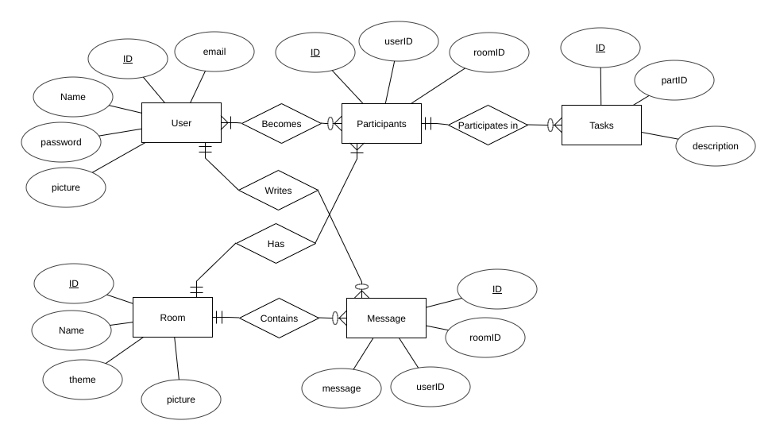

##  Preliminary Database Design Document

#####  James Byrne, Sam Savini
#####  Introduction to Database Systems
#####  October 18th, 2018

1\.  Preliminary Database Design

1.1.  Project description, database engine used, potential users, maybe some other stuff

>  TODO

1.2.  Data description, generally what type of data will be stored

>  TODO

1.3.  At least five examples of the type of data your database will provide _to the user_

>  TODO

1.4.  A preliminary idea of the schema of the database including table descriptions and potential columns

>  The activity/task database will have a tasks table which contains a description of the task and a unique ID. The participants table will hold all of the participants of tasks with their user info and what task they are a part of. The user table will hold info on all of the users using BetterWe. A room table will be used to keep information on the task environment including a picture, name ID and theme. Finally, the message table will keep track of the messages that participants in each task are sending to each other. Attributes in this table include the message contents, room ID, task ID, and user IDs.
 
1.5.  A complete preliminary Entity-Relationship Diagram [ERD] for the database [NOT hand-drawn, PLEASE!]

>  
